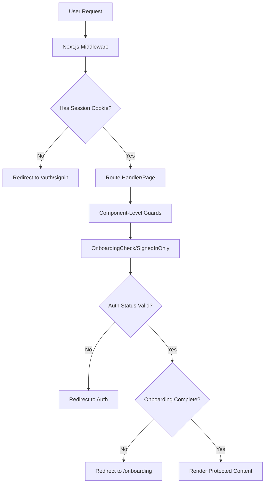

# Performance Optimisations Guide

This document outlines the various performance optimisations implemented in PrepMate. We focus on server-side rendering, client-side caching, and authentication patterns to deliver excellent user experience.

## Table of Contents

1. [Core Concepts](#core-concepts)
2. [Server-Side Authentication & Authorization](#server-side-authentication--authorization)
3. [React Query for Client-Side Caching](#react-query-for-client-side-caching)
4. [SSR vs CSR Strategy](#ssr-vs-csr-strategy)
5. [Route Protection Components](#route-protection-components)
6. [Implementation Examples](#implementation-examples)

## Core Concepts

### Server-Side Rendering (SSR) vs Client-Side Rendering (CSR)

**Server-Side Rendering (SSR):**

- HTML is generated on the server for each request
- Faster **First Contentful Paint (FCP)** - users see content immediately
- Better SEO as content is available to crawlers
- Authenticated data can be pre-fetched securely on the server

**Client-Side Rendering (CSR):**

- JavaScript runs in the browser to generate content
- Better for interactive features and subsequent navigation
- Can leverage browser caching and React Query for data management
- Reduced server load for subsequent requests

### First Contentful Paint (FCP)

FCP measures when the first text or image is painted to the screen. Our optimisations target this metric through:

- Server-side pre-rendering of authenticated pages
- Strategic use of loading states
- Efficient data fetching patterns

## Server-Side Authentication & Authorization

### Architecture Overview

We implement a **multi-layered authentication system** that performs checks at both the middleware and component level:



### Key Components

#### 1. Data Access Layer (DAL)

Located in `src/lib/dal.ts`, this provides cached session verification:

```typescript
// Uses React.cache() to memoize auth checks during server render
export const getSession = cache(async () => {
  const session = await auth();
  if (!session?.user) return null;

  return {
    isAuth: true,
    userId: session.user.id,
    user: session.user,
  };
});
```

With this, we ensure that we **only call the database once** to check if the user is authenticated. It's cached during render pass, so multiple components can call `getSession()` without additional database queries.

#### 2. Middleware Protection

`src/middleware.ts` provides the first line of defense:

```typescript
const protectedRoutes = ["/dashboard", "/profile/", "/onboarding"];

export default async function middleware(req: NextRequest) {
  const path = req.nextUrl.pathname;
  const isProtectedRoute = protectedRoutes.some((route) =>
    path.startsWith(route),
  );

  if (isProtectedRoute && !sessionCookie) {
    return NextResponse.redirect(new URL("/auth/signin", req.nextUrl));
  }
}
```

This ensures that unauthenticated users (without a session cookie) are redirected before page components load.

## React Query for Client-Side Caching

### Caching Strategy

We use **TanStack Query (React Query)** integrated with tRPC for intelligent data caching:

#### Profile Data Caching

```typescript
// In ProfilePageClient component
const {
  data: profile,
  isFetching,
  error,
  refetch,
} = api.onboarding.getProfile.useQuery(undefined, {
  staleTime: 1000 * 60 * 5, // 5 minutes - don't refetch if data is fresh
});
```

#### Query Client Configuration

```typescript
// src/trpc/query-client.ts
export const createQueryClient = () =>
  new QueryClient({
    defaultOptions: {
      queries: {
        staleTime: 30 * 1000, // 30 seconds default staleness
      },
    },
  });
```

### Benefits of This Approach

- Moving between `/dashboard` → `/profile` → `/dashboard` doesn't refetch user data
- Profile edits update cache immediately
- Stale data is refetched in the background
- Built-in retry logic and error states

### Cache Invalidation Strategy

```typescript
// When profile is updated
const utils = api.useUtils();

const handleEditComplete = async () => {
  await utils.onboarding.getProfile.invalidate(); // Refresh profile cache
  router.push("/profile");
};
```

## SSR vs CSR Strategy

### Our Hybrid Approach

We strategically combine SSR and CSR based on the page requirements:

#### Server-Side Rendered Pages (`page.tsx`)

**Used for:**

- Authentication checks
- SEO-critical content
- Initial page structure
- Server-side data that needs immediate availability

```typescript
// src/app/profile/page.tsx
export default async function ProfilePage() {
  return (
    <OnboardingCheck> {/* Server-side auth check */}
      <ProfilePageClient /> {/* Client-side interactivity */}
    </OnboardingCheck>
  );
}
```

#### Client-Side Components (`*Client.tsx`)

**Used for:**

- Interactive features
- Data fetching with caching
- State management
- Real-time updates

```typescript
// src/app/profile/_components/ProfilePageClient.tsx
export function ProfilePageClient() {
  const { data: profile, isFetching } = api.onboarding.getProfile.useQuery(undefined, {
    staleTime: 1000 * 60 * 5,
  });

  if (isFetching) {
    return <LoadingSpinner fullScreen text="Loading profile..." size="lg" />;
  }

  return <ProfileContent profile={profile} />;
}
```

### Loading States for Better FCP

We use Next.js `loading.tsx` files to provide immediate feedback:

```typescript
// src/app/dashboard/loading.tsx
export default function DashboardLoading() {
  return <LoadingSpinner fullScreen size="lg" />;
}
```

**Benefits:**

- **Instant feedback** - Users see loading state immediately
- **Perceived performance** - App feels faster even if data loading takes time
- **Consistent UX** - Standardized loading states across the app

## Route Protection Components

### OnboardingCheck Component

**Purpose:** Ensures users complete onboarding before accessing main features

```typescript
// src/app/_components/OnboardingCheck.tsx
export async function OnboardingCheck({ reverse = false, children }: OnboardingCheckProps) {
  const session = await getSession(); // Cached session check

  if (!session) {
    redirect("/auth/signin");
  }

  const onboardingStatus = await api.onboarding.getOnboardingStatus(); // Server-side data fetch

  if (reverse) {
    // For onboarding page: redirect completed users to dashboard
    if (onboardingStatus.hasCompletedOnboarding) {
      redirect("/dashboard");
    }
    return <>{children}</>;
  } else {
    // For other pages: redirect incomplete users to onboarding
    if (!onboardingStatus.hasCompletedOnboarding) {
      redirect("/onboarding");
    }
    return <>{children}</>;
  }
}
```

In this way, we use server-side redirects to prevent flash of wrong content.

### SignedOutOnly Component

**Purpose:** Protects authentication pages from already authenticated users

```typescript
// src/app/_components/SignedOutOnly.tsx
export async function SignedOutOnly({ children, redirectTo = "/dashboard" }: SignedOutOnlyProps) {
  const session = await getSession();

  if (session) {
    redirect(redirectTo); // Redirect authenticated users away
  }

  return <>{children}</>;
}
```

**Use Cases:**

- Sign-in pages (`/auth/signin`)
- Email verification pages (`/auth/verify-request`)
- Public-only content

### SignedInOnly Component

**Purpose:** Generic authentication wrapper for protected content

```typescript
// src/app/_components/SignedInOnly.tsx
export async function SignedInOnly({ children, redirectTo = "/auth/signin" }: SignedInOnlyProps) {
  const session = await getSession();

  if (!session) {
    redirect(redirectTo);
  }

  return <>{children}</>;
}
```

## Implementation Examples

### Protecting Dashboard Pages

```typescript
// src/app/dashboard/page.tsx
export default function DashboardPage() {
  return (
    <OnboardingCheck>
      {/* Server-side auth + onboarding check */}
      <div className="min-h-screen">
        <Navigation />
        <DashboardClientPage /> {/* Client-side data fetching */}
      </div>
    </OnboardingCheck>
  );
}
```

### Protecting Auth Pages

```typescript
// src/app/auth/signin/page.tsx
export default function SignInPage() {
  return (
    <SignedOutOnly>
      <main className="min-h-screen">
        <SignInForm /> {/* Client-side form handling */}
      </main>
    </SignedOutOnly>
  );
}
```

### Profile Page with Caching

```typescript
// src/app/profile/page.tsx - Server Component
export default async function ProfilePage() {
  return (
    <OnboardingCheck>
      <ProfilePageClient />
    </OnboardingCheck>
  );
}

// src/app/profile/_components/ProfilePageClient.tsx - Client Component
export function ProfilePageClient() {
  const { data: profile, isFetching } = api.onboarding.getProfile.useQuery(undefined, {
    staleTime: 1000 * 60 * 5, // Cache for 5 minutes
  });

  return (
    <div>
      <ProfileNavigation />
      {isFetching ? (
        <LoadingSpinner fullScreen text="Loading profile..." />
      ) : (
        <ProfileContent profile={profile} />
      )}
    </div>
  );
}
```

### Edit Profile with Cache Invalidation

```typescript
// src/app/profile/edit/_components/EditProfilePageClient.tsx
export function EditProfilePageClient() {
  const utils = api.useUtils();

  const { data: profileData, isLoading } = api.onboarding.getProfile.useQuery();

  const handleEditComplete = async () => {
    await utils.onboarding.getProfile.invalidate(); // Refresh cache
    router.push("/profile");
  };

  if (isLoading) {
    return <LoadingSpinner fullScreen size="lg" />;
  }

  return (
    <OnboardingForm
      initialData={transformedProfileData}
      onComplete={handleEditComplete}
    />
  );
}
```

## Performance Benefits

### Measured Improvements

1. **First Contentful Paint (FCP):**

   - Server-side auth checks eliminate authentication loading states
   - `Loading.tsx` files provide immediate visual feedback
   - Cached session checks reduce database queries

2. **Navigation Performance:**

   - React Query caching prevents redundant API calls
   - Profile data persists across page navigation
   - Background refetching keeps data fresh

3. **Perceived Performance:**

   - Loading spinners maintain user engagement
   - Optimistic updates for form submissions
   - Consistent loading patterns across the app

4. **Server Efficiency:**
   - Middleware-level protection reduces server load
   - Cached authentication checks during render
   - Strategic use of server vs client components

### Best Practices Summary

1. **Use server components for authentication checks** - Faster, more secure
2. **Implement proper loading states** - Better perceived performance
3. **Cache expensive operations** - Reduce redundant data fetching
4. **Strategic component splitting** - Server for auth, client for interactivity
5. **Consistent error handling** - Graceful fallbacks and retry mechanisms

This architecture provides a robust, performant foundation that scales well with user growth while maintaining excellent user experience.
